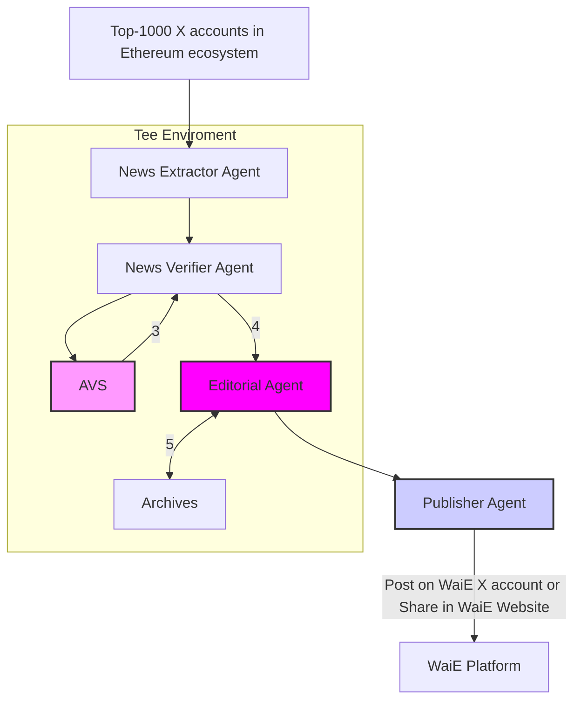

# Agent Architecture

This diagram illustrates the architecture of the Week in Ethereum News AI Edition system, incorporating the AI-Agentic Journalism Workflow and the Two-Token Model.

## Agent Descriptions

### Content Pipeline Agents

- **News Extractor Agent**: **Report Submission & Draft Generation**: Monitors and collects Ethereum news from "Top-1000 X accounts in Ethereum ecosystem".  This agent extracts relevant information from these sources, acting as the initial point of contact for news gathering.
- **News Verifier Agent**: **Verification Process**:  This agent is responsible for verifying the information extracted by the News Extractor Agent.  It leverages **EigenLayer Actively Validated Services (AVSs)** to perform verifiable checks on the news, enhancing the trustworthiness of the curated content.  Verification techniques may include source credibility analysis and fact-checking. This agent operates within a **Trusted Execution Environment (TEE)** to ensure secure and reliable verification processes.
- **AVS (EigenLayer Actively Validated Service)**:  An **Autonomous Verifiable Service** on EigenLayer that provides verifiable services for the News Verifier Agent.  AVS offers an additional layer of trust and transparency to the news verification process. The project is exploring the concept of **"Level 1 Agents"** as a standardized way for agents to interact with AVSs, aiming for a more verifiable and transparent news curation process.

### Editorial and Publishing Agents

- **Editorial Agent**: **Editorial Review**:  This agent performs the editorial review of the verified news. It receives feedback from the News Verifier Agent and can consult "Archives" for context.  The Editorial Agent makes decisions on content revisions and finalization, ensuring adherence to editorial standards.  It operates within the **Trusted Execution Environment (TEE)**.
- **Publisher Agent**: **Publication**:  Responsible for publishing the finalized news.  This agent distributes the content to the "WaiE X account" (e.g., on X/Twitter) and/or the "WaiE Website", making the curated news accessible to the audience.

## Data Flow

This section outlines the flow of information between agents, as depicted in the architecture diagram:

1.  **Data Source**: The process begins with data from "Top-1000 X accounts in Ethereum ecosystem", which serves as the primary source of news and information.
2.  **News Extraction**: The **News Extractor Agent** (1) extracts relevant news and information from the data source.
3.  **News Verification**: The extracted information is passed to the **News Verifier Agent** (2), which utilizes **AVS (EigenLayer Actively Validated Service)** (3) to perform verifiable checks.
4.  **Feedback Loop**: A feedback loop (4) exists between the **News Verifier Agent** and the **Editorial Agent**. If the verification process requires further editorial review or input, the News Verifier Agent communicates with the Editorial Agent.
5.  **Archives Consultation**: The **Editorial Agent** (5) can consult "Archives" for historical context and information relevant to the news being reviewed.
6.  **Publication**: Once the editorial review is complete, the **Editorial Agent** sends the finalized news to the **Publisher Agent** (6), which publishes the content on the "WaiE X account" or "WaiE Website".

## AI-Agentic Journalism Workflow

This section outlines the workflow of content creation, inspired by the AI-Agentic Journalism model:

1.  **Report Submission (News Extractor Agent)**: The News Extractor Agent continuously monitors news sources ("Top-1000 X accounts in Ethereum ecosystem") and identifies relevant information, acting as the initial point of "report" submission.
2.  **Verification Process (News Verifier Agent, AVS)**: The News Verifier Agent takes the extracted information and initiates the verification process, leveraging EigenLayer AVS for verifiable checks.
3.  **Editorial Review (Editorial Agent)**: The Editorial Agent reviews the verified news, incorporating feedback and consulting archives as needed. It makes editorial decisions to finalize the content.
4.  **Publication (Publisher Agent)**: Once the content is finalized, the Publisher Agent publishes the news through the designated channels ("WaiE X account" and "WaiE Website").

This workflow provides a structured approach to news curation, emphasizing verifiability and editorial oversight.

## Tokenomics

The "Week in Ethereum News AI Edition" project incorporates a two-token model ($EDIT and ETH) to incentivize participation, ensure economic security, and foster community governance.  See the [FEATURES.md](FEATURES.md) document for a detailed description of the tokenomics model.

## Verifiability Considerations and Future Directions

The "Week in Ethereum News AI Edition" project is strongly committed to building a trustworthy and transparent news platform.  Inspired by the 'Level 1 Agent' concept and EigenLayer's Autonomous Verifiable Services (AVSs) architecture, this architecture is designed with verifiability at its core.

The **News Verifier Agent** utilizes **EigenLayer AVS** to provide cryptographic assurance of the integrity and unbiased nature of our news curation process.  By integrating with AVS, the system aims to enhance the transparency and trustworthiness of the AI agents' verification process.  The agents operate within a **Trusted Execution Environment (TEE)**, further strengthening the security and reliability of the system.

Future directions include deeper exploration of EigenLayer AVS capabilities, investigating verifiable data sources, and continuously improving the verifiability and transparency of the AI-driven news curation process.  The project aims to be at the forefront of verifiable AI journalism, providing users with confidence in the integrity of the information presented.
