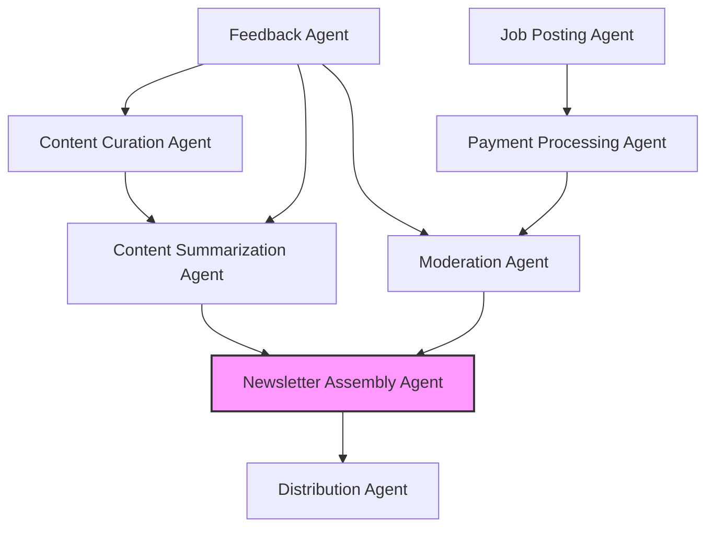

# Agent Architecture

This diagram illustrates the architecture of the Week in Ethereum News AI Edition system.

## Agent Descriptions

### Content Pipeline Agents
- **Content Curation Agent**: Monitors and collects Ethereum news from trusted sources, social media, and community platforms.
- **Content Summarization Agent**: Processes collected news items, generates concise summaries while maintaining accuracy and context.
- **Newsletter Assembly Agent**: Combines summaries and job postings into a cohesive newsletter format.

### Job Posting Pipeline Agents
- **Job Posting Agent**: Handles submission of job postings from sponsors.
- **Payment Processing Agent**: Manages payment simulation/processing for job postings.
- **Moderation Agent**: Ensures job postings meet quality standards and relevance criteria.

### Support Agents
- **Distribution Agent**: Handles newsletter delivery and distribution channels.
- **Feedback Agent**: Monitors performance metrics and user feedback to improve system quality.
