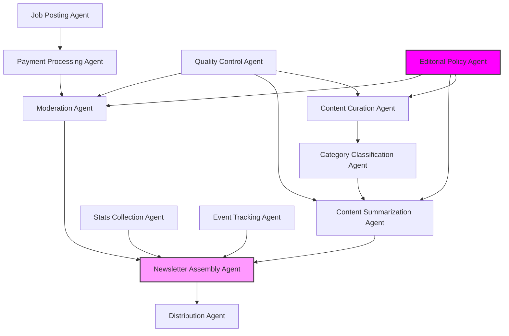

# Agent Architecture

This diagram illustrates the architecture of the Week in Ethereum News AI Edition system.

## Agent Descriptions

### Content Pipeline Agents
- **Content Curation Agent**: Monitors and collects Ethereum news from trusted sources, validates links, and evaluates source credibility.
- **Category Classification Agent**: Classifies content into newsletter sections (Layer 1, Security, EIPs, etc.).
- **Content Summarization Agent**: Generates technically accurate summaries maintaining Week in Ethereum News style.
- **Newsletter Assembly Agent**: Structures content into consistent newsletter format with all required sections.

### Data Collection Agents
- **Stats Collection Agent**: Aggregates onchain metrics, gas fees, prices, and key ratios.
- **Event Tracking Agent**: Maintains database of upcoming events, conferences, and protocol upgrades.

### Job Posting Pipeline Agents
- **Job Posting Agent**: Manages job submissions with 75-char limit validation and 4-issue tracking.
- **Payment Processing Agent**: Handles $600/4-issue payments and renewal notifications.
- **Moderation Agent**: Ensures job postings meet guidelines and maintains listing quality.

### Quality Control Agents
- **Distribution Agent**: Manages newsletter delivery and distribution channels.
- **Quality Control Agent**: Verifies technical accuracy, link validity, and style consistency.
- **Editorial Policy Agent**: Maintains editorial standards and section-specific guidelines.
