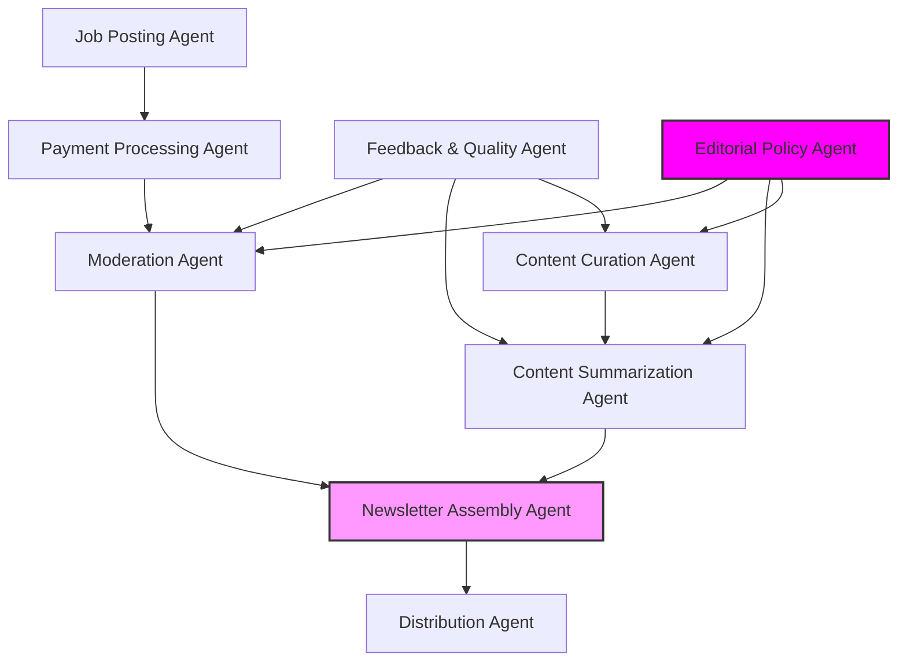

# Agent Architecture

This diagram illustrates the architecture of the Week in Ethereum News AI Edition system.

## Agent Descriptions

### Content Pipeline Agents
- **Content Curation Agent**: Monitors and collects Ethereum news from trusted sources, social media, and community platforms. Uses AI to evaluate source credibility and content relevance.
- **Content Summarization Agent**: Processes collected news items, generates concise summaries while maintaining accuracy and context. Implements style matching to maintain Week in Ethereum News' tone.
- **Newsletter Assembly Agent**: Combines summaries and job postings into a cohesive newsletter format. Ensures consistent structure and readability.

### Job Posting Pipeline Agents
- **Job Posting Agent**: Handles submission of job postings from sponsors. Provides structured input forms and validation.
- **Payment Processing Agent**: Manages payment simulation/processing for job postings. Implements secure transaction handling.
- **Moderation Agent**: Ensures job postings meet quality standards and relevance criteria. Uses AI to detect spam and assess posting quality.

### Quality Control Agents
- **Distribution Agent**: Handles newsletter delivery and distribution channels. Manages subscriber lists and delivery metrics.
- **Feedback & Quality Agent**: Monitors performance metrics, user feedback, and content quality. Provides insights for continuous improvement.
- **Editorial Policy Agent**: Maintains editorial standards and consistency with Week in Ethereum News' legacy. Guides content selection and presentation.
