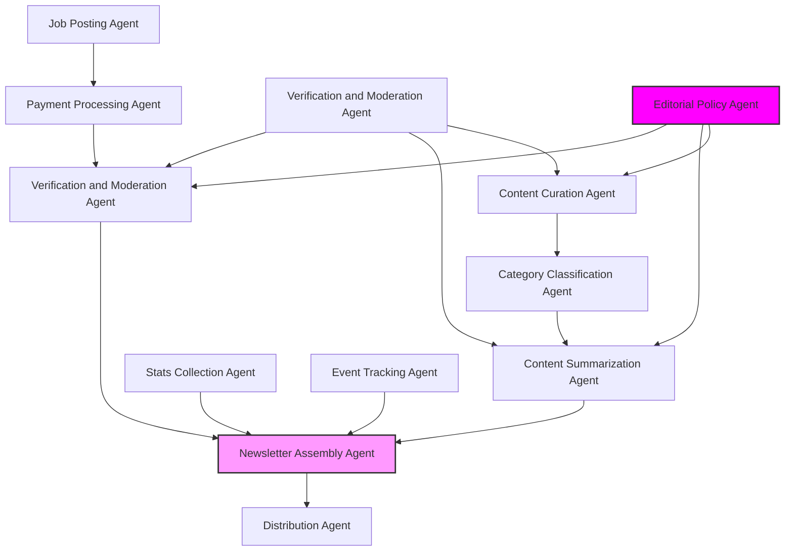

# Agent Architecture

This diagram illustrates the architecture of the Week in Ethereum News AI Edition system, incorporating the AI-Agentic Journalism Workflow and the Two-Token Model.

## Agent Descriptions

### Content Pipeline Agents
- **Content Curation Agent**: **Report Submission & Draft Generation**: Monitors and collects Ethereum news from trusted and potentially verifiable sources, validates links, and evaluates source credibility.  Compiles an initial draft of news items, ensuring privacy and protecting original sources. Audio content is transcribed, and data is analyzed as needed.
- **Category Classification Agent**: Classifies content into newsletter sections (Layer 1, Security, EIPs, etc.).
- **Content Summarization Agent**: Generates technically accurate summaries maintaining Week in Ethereum News style, contributing to the draft generation.
- **Newsletter Assembly Agent**: Structures content into consistent newsletter format with all required sections.

### Data Collection Agents
- **Stats Collection Agent**: Aggregates onchain metrics, gas fees, prices, and key ratios.
- **Event Tracking Agent**: Maintains database of upcoming events, conferences, and protocol upgrades.

### Job Posting Pipeline Agents
- **Job Posting Agent**: Manages job submissions with 75-char limit validation and 4-issue tracking.
- **Payment Processing Agent**: Handles job posting payments in ETH or stablecoins and manages renewal notifications. A portion of the revenue from job postings may be used to support the $EDIT token ecosystem (e.g., buying $EDIT for rewards distribution).
- **Verification and Moderation Agent**: **Verification Process & Moderation**: Employs verifiable methods to communicate with verifiers (potentially human editors or specialized AI agents) to gather feedback on content drafts, including approvals, rejections, or required modifications. Ensures job postings meet guidelines and maintains listing quality. This agent performs both content verification and job posting moderation.  Verifiers may be rewarded with $EDIT for their contributions.

### Quality Control Agents
- **Distribution Agent**: **Publication**: Manages newsletter delivery and distribution channels, publishing finalized content as a newsletter.
- **Verification and Moderation Agent**: (See description above under Job Posting Pipeline Agents - this agent is shared across pipelines for efficiency in verification and moderation tasks).
- **Editorial Policy Agent**: **Editorial Review**: Collects verifier feedback, original reports (from Content Curation Agent), and archives. Based on this input, decides whether to revise the draft and resubmit it for verification or finalize the content for publication. Maintains editorial standards and section-specific guidelines.  Reporters may be rewarded with $EDIT for their contributions.

## AI-Agentic Journalism Workflow

This section outlines the workflow of content creation, inspired by the AI-Agentic Journalism model:

1.  **Report Submission (Content Curation Agent)**: The Content Curation Agent acts as the initial point of contact for news "reports" by continuously monitoring news sources and identifying relevant information.
2.  **Draft Generation (Content Curation Agent, Category Classification Agent, Content Summarization Agent)**: The Content Curation Agent, along with the Category Classification Agent and Content Summarization Agent, collaboratively compile an initial draft of the newsletter content. This involves categorizing news items and generating summaries.
3.  **Verification Process (Verification and Moderation Agent)**: The Verification and Moderation Agent takes the draft content and initiates the verification process. This involves communicating with verifiers to gather feedback, including approvals, rejections, or requests for modifications.
4.  **Editorial Review (Editorial Policy Agent)**: The Editorial Policy Agent reviews the verifier feedback, the original curated content, and potentially past newsletters. Based on this comprehensive input, it makes an editorial decision: either revise the draft and send it back for verification, or finalize the content for publication.
5.  **Publication (Distribution Agent)**: Once the content is finalized by the Editorial Policy Agent, the Distribution Agent takes over to publish the content through the designated newsletter distribution channels.

This workflow ensures a structured approach to content creation, incorporating verification and editorial oversight at key stages.

## Tokenomics

The "Week in Ethereum News AI Edition" project incorporates a two-token model ($EDIT and ETH) to incentivize participation, ensure economic security, and foster community governance.  See the [FEATURES.md](FEATURES.md) document for a detailed description of the tokenomics model.  The Payment Processing Agent plays a key role in managing revenue from job postings and potentially using a portion of it to support the $EDIT ecosystem.  Rewards in $EDIT are distributed to contributors through the Verification and Moderation Agent and Editorial Policy Agent for their roles in content creation and verification.

## Verifiability Considerations and Future Directions

The "Week in Ethereum News AI Edition" project is committed to building a trustworthy and transparent news platform.  Inspired by the 'Level 1 Agent' concept and EigenLayer's Autonomous Verifiable Services (AVSs) architecture, we are exploring ways to enhance the verifiability of our AI agents.  While our current agents operate off-chain for practical reasons, we are designing our system with verifiability in mind.  Future directions include investigating verifiable data sources, exploring policy AVS concepts for editorial guidelines enforcement, and considering the potential integration of verifiable offchain inference technologies like EigenLayer AVSs in the long term.  This commitment to verifiability aims to provide users with cryptographic assurance of the integrity and unbiased nature of our news curation process.
