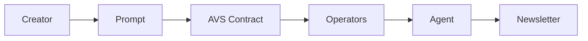

# Week in Ethereum News AI Edition

[](https://ethglobal.com)
[](LICENSE)

> Continuing the legacy of Week in Ethereum News through AI innovation

## About

Week in Ethereum News AI Edition is a project developed during the ETH Global Agentic AI hackathon to continue the valuable service provided by Week in Ethereum News, which ceased operations at the end of 2024.  The original "Week in Ethereum News" was distributed through a popular Substack page and email list. Our system uses AI agents to curate, summarize, and deliver comprehensive weekly updates about the Ethereum ecosystem, including paid job postings from sponsors.

## Features

- 🤖 AI-powered news curation and summarization
- 📰 Automated weekly newsletter generation
- 💼 Integrated job posting system for sponsors
- 🔍 Quality control through AI moderation
- 📊 Feedback-driven continuous improvement

## Architecture

<<<<<<< HEAD
Our system uses a multi-agent architecture based on Autogen, orchestrated within a Society of Mind pattern.  A key innovation is the integration of an EigenLayer Autonomous Verifiable Service (AVS) to implement Verifiable Agent Prompts.

**Mermaid Diagram of Workflow:**



**Agent Roles:**

- **Manager Agent:** Orchestrates the newsletter creation process, defines tasks, and manages the workflow. Its instructions are now verifiably approved.
- **Critic Agent:** Reviews plans and results, ensuring quality and completeness of the newsletter content.
- **Web Scraper Agent:** Gathers relevant information from the web based on prompts and instructions.
- **Coder Agent:**  (Currently under development)  Will be used for data analysis and potentially code-assisted content generation in future iterations.
- **Telegram Poster Agent:**  Automates posting the generated newsletter to a Telegram channel.
- **Twitter Poster Agent:** (Currently commented out)  Intended for automated posting to Twitter (future feature).
- **Agentic Operators (Simulated):**  Represent a network of entities that deploy **Verification Agents** to automatically review and verify the prompts. In this Proof of Concept, they are simulated by running `prompt_operator.py`.
- **Verification Agents (within Operators):** Specialized AI agents deployed by operators. They automatically check if a given Agent Prompt adheres to predefined **Verification Policies** (e.g., topic relevance, tone, length).

See [docs/ARCHITECTURE.md](docs/ARCHITECTURE.md) for more detailed information about each agent's role and responsibilities (to be updated).
=======
Our system uses a multi-agent architecture where specialized AI agents handle different aspects of the newsletter production pipeline. See [docs/ARCHITECTURE.md](docs/ARCHITECTURE.md) for detailed information about each agent's role and responsibilities.
>>>>>>> parent of 1dd81ca (feat: Implement verifiable agent prompts and update readme)

## Getting Started

### Prerequisites

- Python 3.9+
- Docker
- Access to required APIs (details in technical documentation)

### Installation

<<<<<<< HEAD
**Please refer to the detailed [installation instructions](docs/README_AVS.md).**
=======
```bash
# Clone the repository
git clone https://github.com/yourusername/week-in-ethereum-news-ai.git
cd week-in-ethereum-news-ai

# Install dependencies
pip install -r requirements.txt

# Set up environment variables
cp .env.example .env
# Edit .env with your API keys and configuration
```
>>>>>>> parent of 1dd81ca (feat: Implement verifiable agent prompts and update readme)

## Documentation

- [Vision Document](docs/VISION.md) - Project goals and value proposition
- [Architecture](docs/ARCHITECTURE.md) - System design and agent interactions
- [Technical Design](docs/TECHNICAL_DESIGN.md) - Technical implementation details
- [Features](docs/FEATURES.md) - Feature list and scope
- [Tasks](docs/TASKS.md) - Development roadmap and task breakdown

## Contributing

We welcome contributions! Please see our [Contributing Guidelines](CONTRIBUTING.md) for details on how to get involved.

## License

This project is licensed under the MIT License - see the [LICENSE](LICENSE) file for details.

## Acknowledgments

- Special thanks to Evan Van Ness and the original Week in Ethereum News team
- ETH Global hackathon organizers and mentors
- The Ethereum community for their support

## Contact

- Project Link: [https://github.com/yourusername/week-in-ethereum-news-ai](https://github.com/yourusername/week-in-ethereum-news-ai)
- Twitter: [@WeInEthNewsAI](https://twitter.com/WeInEthNewsAI)

---
Built with ❤️ for the Ethereum community
