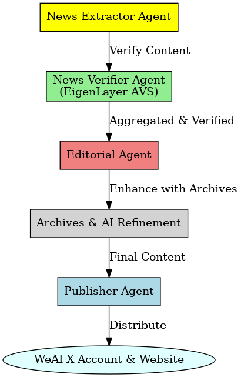

Week in Ethereum News AI Edition

[](https://ethglobal.com)  
[](LICENSE)

> **An AI-powered continuation of "Week in Ethereum News" leveraging EigenLayer AVS and decentralized AI agents**

## About

The **Week in Ethereum News AI Edition** is a project developed for the **ETH Global Agentic AI Hackathon** to revive and enhance the legacy of "Week in Ethereum News," a popular newsletter that provided valuable weekly updates to the Ethereum ecosystem until it ceased operations in January 2025. 

Our solution automates the curation, verification, and distribution of high-quality Ethereum news through a network of **AI agents**, decentralized **EigenLayer AVS** verification, and cutting-edge content generation techniques. This new version of "Week in Ethereum News" aims to provide timely and accurate insights into the Ethereum ecosystem while maintaining transparency and trust in the process.

## Features

- 🤖 **AI-powered news extraction, verification, and summarization**
- 📢 **Decentralized verification using EigenLayer AVS**
- 📰 **Automated weekly newsletter generation**
- 💼 **Integrated job posting system for sponsors**
- 🔍 **Quality control through AI editorial and moderation**
- 📊 **Feedback-driven continuous improvement**

## Architecture

Our system consists of multiple AI agents, each responsible for different aspects of the news pipeline. The verification process is decentralized using **EigenLayer AVS**, ensuring trust and transparency in the news curation process.

### **System Overview**



### **Detailed Agent Descriptions**

#### 1️⃣ **News Extractor Agent**
- **Aggregates relevant data** from top Ethereum-related sources (Twitter, Substack, blogs, GitHub, etc.).
- Uses **AI & NLP** for **text, image, and video analysis**.

#### 2️⃣ **News Verifier Agent (AVS Integrated)**
- **Decentralized verification** using **EigenLayer AVS**.
- A **network of verifier agents** reviews, approves, or suggests modifications to extracted content.
- Ensures **credibility and accuracy** before publishing.
- For example, if a new project is mentioned in the Ethereum community, the News Verifier Agent cross-references multiple sources and validators in the network to confirm whether the project is legitimate and its claims accurate before it reaches the editorial team.

#### 3️⃣ **Editorial Agent**
- Refines content using **archival data and AI tools**.
- Decides whether to **resubmit, finalize, or modify** the content.
- Ensures **cohesion, readability, and engagement**.
- Based on the verified news, this agent optimizes the language, tone, and formatting of the content to ensure it is both informative and engaging to the audience.

#### 4️⃣ **Publisher Agent**
- Publishes the **finalized content** to **Twitter, website, and newsletters**.
- Supports **multi-channel distribution** with audience segmentation.

## Getting Started

### **Prerequisites**
- Python 3.9+
- Docker
- Access to required APIs (details in technical documentation)

### **Installation**

```bash
# Clone the repository
git clone https://github.com/Agentopians/WeAi.git
cd WeAi

# Install dependencies
pip install -r requirements.txt

# Set up environment variables
cp .env.example .env
# Edit .env with your API keys and configuration
```

## Documentation

- 📜 **[Vision Document](docs/VISION.md)** - Project goals and value proposition
- 🏗️ **[Architecture](docs/ARCHITECTURE.md)** - System design and agent interactions
- 🔧 **[Technical Design](docs/TECHNICAL_DESIGN.md)** - Technical implementation details
- 🚀 **[Features](docs/FEATURES.md)** - Feature list and scope
- 📋 **[Tasks](docs/TASKS.md)** - Development roadmap and task breakdown

## Partners & Integrations

- **EigenLayer AVS** → Decentralized verification through AVS.
- **Gaia AI** → Advanced NLP for content analysis and summarization.
- **Autonome** → AI-driven autonomous agent frameworks.

## Contributing

We welcome contributions! Please see our [Contributing Guidelines](CONTRIBUTING.md) for details on how to get involved.

## License

This project is licensed under the MIT License - see the [LICENSE](LICENSE) file for details.

## Acknowledgments

- 🎙️ **Evan Van Ness and the original "Week in Ethereum News" team**
- 🏆 **ETH Global Hackathon organizers and mentors**
- 🌍 **The Ethereum community for their support**

## Contact

- 📌 Project Link: [https://github.com/yourusername/week-in-ethereum-news-ai](https://github.com/yourusername/week-in-ethereum-news-ai)
- 🐦 Twitter: [@WeInEthNewsAI](https://twitter.com/WeInEthNewsAI)

---
Built with ❤️ for the Ethereum community
---