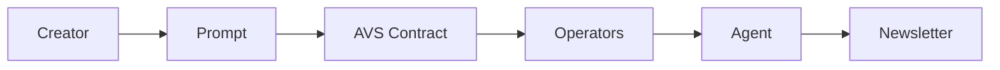

# Week in Ethereum News AI Edition

[](https://ethglobal.com)
[](LICENSE)

> Continuing the legacy of Week in Ethereum News through AI innovation, now with verifiable agent prompts

## About

Week in Ethereum News AI Edition is a project developed during the ETH Global Agentic AI hackathon to continue the valuable service provided by Week in Ethereum News, which ceased operations at the end of 2024.  The original "Week in Ethereum News" was distributed through a popular Substack page and email list. Our system uses AI agents to curate, summarize, and deliver comprehensive weekly updates about the Ethereum ecosystem, including paid job postings from sponsors.

**Key Innovation: Verifiable Agent Prompts**

This AI Edition introduces a novel approach to ensure the trustworthiness and transparency of the newsletter generation process. We implement **Verifiable Agent Prompts** using an EigenLayer Autonomous Verifiable Service (AVS). This means:

- The **instructions (prompts)** given to our AI agents are explicitly defined and auditable.
- A network of **Agentic Operators** (simulated in this PoC) automatically reviews and verifies these prompts based on predefined policies.
- The **verification outcome is recorded on the Ethereum blockchain**, providing cryptographic proof of prompt approval.
- The AI newsletter agent only proceeds with content generation if its prompt has been verifiably **approved by the operator network.**

This system aims to enhance user trust by ensuring that the AI-generated newsletter is created under verifiably sound and policy-compliant instructions.

## Features

- 🤖 AI-powered news curation and summarization using Autogen agents
- 📰 Automated weekly newsletter generation workflow
- 💼 Integrated job posting system (placeholder for future sponsor integration)
- ✅ **Verifiable Agent Prompts:** Ensures prompts are reviewed and approved by a network of Agentic Operators via EigenLayer AVS for increased transparency and trust.
- 🔍 Quality control through automated policy-based prompt verification by Agentic Operators.
- 📊 Feedback-driven continuous improvement (future feature)

## Architecture

Our system uses a multi-agent architecture based on Autogen, orchestrated within a Society of Mind pattern.  A key innovation is the integration of an EigenLayer Autonomous Verifiable Service (AVS) to implement Verifiable Agent Prompts.

**Mermaid Diagram of Workflow:**



**Agent Roles:**

- **Manager Agent:** Orchestrates the newsletter creation process, defines tasks, and manages the workflow. Its instructions are now verifiably approved.
- **Critic Agent:** Reviews plans and results, ensuring quality and completeness of the newsletter content.
- **Web Scraper Agent:** Gathers relevant information from the web based on prompts and instructions.
- **Coder Agent:**  (Currently under development)  Will be used for data analysis and potentially code-assisted content generation in future iterations.
- **Telegram Poster Agent:**  Automates posting the generated newsletter to a Telegram channel.
- **Twitter Poster Agent:** (Currently commented out)  Intended for automated posting to Twitter (future feature).
- **Agentic Operators (Simulated):**  Represent a network of entities that deploy **Verification Agents** to automatically review and verify the prompts. In this Proof of Concept, they are simulated by running `prompt_operator.py`.
- **Verification Agents (within Operators):** Specialized AI agents deployed by operators. They automatically check if a given Agent Prompt adheres to predefined **Verification Policies** (e.g., topic relevance, tone, length).

See [docs/ARCHITECTURE.md](docs/ARCHITECTURE.md) for more detailed information about each agent's role and responsibilities (to be updated).

## Getting Started

### Prerequisites

- Python 3.9+
- Docker
- Foundry (for smart contract development)
- Access to required APIs (OpenAI API key, Telegram Bot Token, Twitter API keys - details in `.env.example`)

### Installation

**Please refer to the detailed installation instructions in [docs/README_AVS.md](docs/README_AVS.md).**

```bash
# Clone the repository
git clone https://github.com/yourusername/week-in-ethereum-news-ai.git
cd week-in-ethereum-news-ai

# Install dependencies
pip install -r requirements.txt

# Set up environment variables
cp .env.example .env
# Edit .env with your API keys and configuration in the `.env` file.
```

### Running the Application (Proof of Concept)

**1. Start Anvil Chain:**

Open a terminal and start the Anvil local Ethereum chain (required for the EigenLayer AVS contracts):

```bash
make start-anvil-chain-with-el-and-avs-deployed
```

**2. Start Aggregator:**

Open another terminal and start the Aggregator component (responsible for interacting with the AVS contracts and aggregating operator signatures):

```bash
python aggregator.py
```

**3. Start Prompt Operator:**

Open a third terminal and start the Prompt Operator (simulating an EigenLayer operator, responsible for automatically verifying agent prompts based on policies):

```bash
python prompt_operator.py
```

**4. Run the Autogen Agents (Newsletter Generation):**

Open a fourth terminal and run the main `agents.py` script to start the newsletter generation workflow. This will initiate the Verifiable Agent Prompt process:

```bash
python agents.py --mode society
```

**5. Interact with the Agent:**

You can now interact with the AI newsletter agent through the `agents.py` terminal. The system will first submit the `manager` agent's instructions for AVS verification.  The `prompt_operator.py` terminal will simulate the automated prompt review process. Once the prompt is (simulated to be) verified, the newsletter generation workflow will begin.

## Documentation

- [Vision Document](docs/VISION.md) - Project goals and value proposition
- [Architecture](docs/ARCHITECTURE.md) - System design and agent interactions (to be updated with AVS integration details)
- [Technical Design](docs/TECHNICAL_DESIGN.md) - Technical implementation details (to be updated with AVS integration details)
- [Features](docs/FEATURES.md) - Feature list and scope
- [Tasks](docs/TASKS.md) - Development roadmap and task breakdown
- [Verifiable Agent Prompts Plan](docs/plan.md) - Detailed plan for implementing the Verifiable Agent Prompts feature.

## Contributing

We welcome contributions! Please see our [Contributing Guidelines](CONTRIBUTING.md) for details on how to get involved.

## License

This project is licensed under the MIT License - see the [LICENSE](LICENSE) file for details.

## Acknowledgments

- Special thanks to Evan Van Ness and the original Week in Ethereum News team
- ETH Global hackathon organizers and mentors
- The Ethereum community for their support
- EigenLayer team for the inspiration and technology enabling Verifiable Agents

## Contact

- Project Link: [https://github.com/yourusername/week-in-ethereum-news-ai](https://github.com/yourusername/week-in-ethereum-news-ai)
- Twitter: [@WeInEthNewsAI](https://twitter.com/WeInEthNewsAI)

---
Built with ❤️ for the Ethereum community
