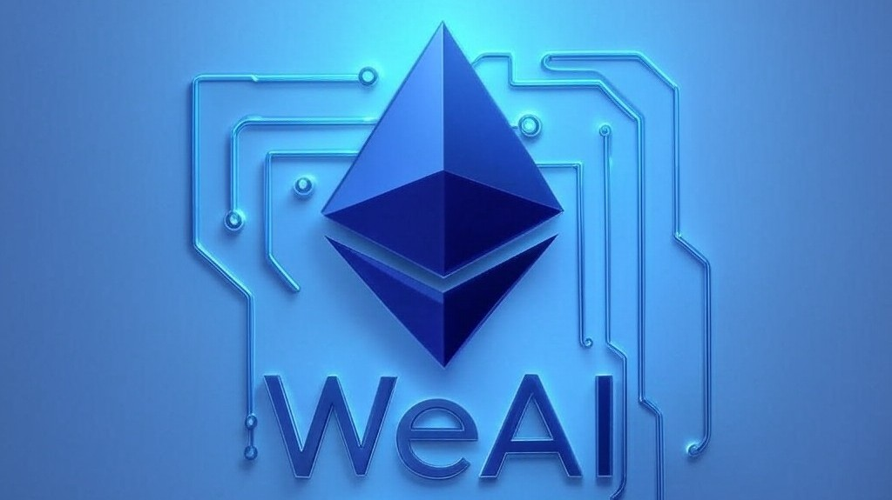

# Week in Ethereum News AI Edition

> Continuing the legacy of Week in Ethereum News through AI innovation

  

## About

Week in Ethereum News AI Edition is a project developed during the ETH Global Agentic AI hackathon to continue the valuable service provided by Week in Ethereum News, which ceased operations at the end of 2024.  The original "Week in Ethereum News" was distributed through a popular Substack page and email list. Our system uses AI agents to curate, summarize, and deliver comprehensive weekly updates about the Ethereum ecosystem, including paid job postings from sponsors.

## Features

- 🤖 AI-powered news curation and summarization
- 📰 Automated weekly newsletter generation
- 💼 Integrated job posting system for sponsors
- 🔍 Quality control through AI moderation
- 📊 Feedback-driven continuous improvement

## Architecture

Our system uses a multi-agent architecture where specialized AI agents handle different aspects of the newsletter production pipeline. See [docs/ARCHITECTURE.md](docs/ARCHITECTURE.md) for detailed information about each agent's role and responsibilities.

## Getting Started

### Prerequisites

- Python 3.9+
- Docker
- Access to required APIs (details in technical documentation)

### Installation

For detailed installation instructions, follow the [Installation Document](docs/INSTALLATION.md)

## Documentation

- [Vision Document](docs/VISION.md) - Project goals and value proposition
- [Architecture](docs/ARCHITECTURE.md) - System design and agent interactions
- [Technical Design](docs/TECHNICAL_DESIGN.md) - Technical implementation details
- [Features](docs/FEATURES.md) - Feature list and scope
- [Tasks](docs/TASKS.md) - Development roadmap and task breakdown

## Contributing

We welcome contributions! Please see our [Contributing Guidelines](CONTRIBUTING.md) for details on how to get involved.

## License

This project is licensed under the MIT License - see the [LICENSE](LICENSE) file for details.

## Acknowledgments

- Special thanks to Evan Van Ness and the original Week in Ethereum News team
- ETH Global hackathon organizers and mentors
- The Ethereum community for their support

## Contact

- Project Link: [https://github.com/yourusername/week-in-ethereum-news-ai](https://github.com/yourusername/week-in-ethereum-news-ai)
- Twitter: [@WeInEthNewsAI](https://twitter.com/WeInEthNewsAI)

---
Built with ❤️ for the Ethereum community
